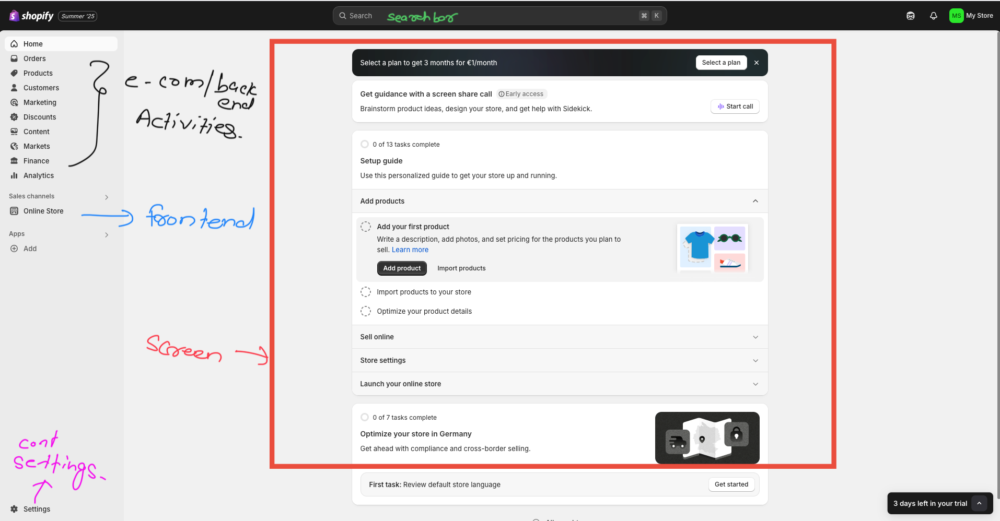

### Account Setup 

- click on [shopify](https://www.shopify.com/?ref=global-ecommerce-enterprises) and set up an account.
- Sign up For New Account.

---
## Understanding Shopify Account

**Understanding Your Shopify Account**

1. **The Admin System (Backend)**:
	    ◦ This is the **"back office"** of your virtual store.
	    ◦ It's where you manage everything: processing orders, gathering products, dealing with inventory, etc.
	    ◦ It's the part that customers don't see
	    
2. **The Storefront (Frontend)**
	    ◦ Shopify automatically provides the **"bare bones of a storefront,"** which is your actual "shop window".
	    ◦ You can view this by clicking a small **"eye" icon** within the admin system.
	    ◦ The backend and storefront **"move together"** as you build your store
	    
3. **Layout of the Admin System**

	- **Menu**: Located on the **left-hand side**
	- **Screen**: The main area that changes content based on your menu selection.
	- **Search Bar**: At the top, allowing you to **"search whatever you want throughout the admin system**

4. **Top Section (Common E-commerce Activities)**:

	- Contains items universal to **"any kind of e-commerce activity"**
	- Key components include **Orders, Products, and Customers** – these three are fundamental to all commerce

5. **Sales Channels**:

	- Refers to the different **"ways for people to buy things from our business"**
	- You can **add other sales channels** like Amazon, a "buy button" for other websites, BuzzFeed, or Facebook, which serve as "points of contact" for products

6. **Settings**:

	- You can Configuring admin and shop Settings.
	- For More Detailed Notes go to [[0. settings]]

